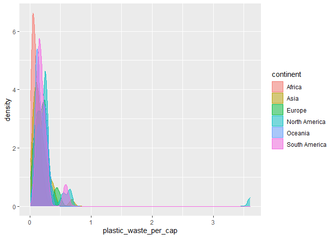
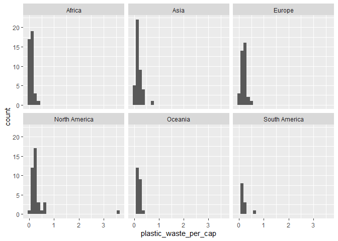
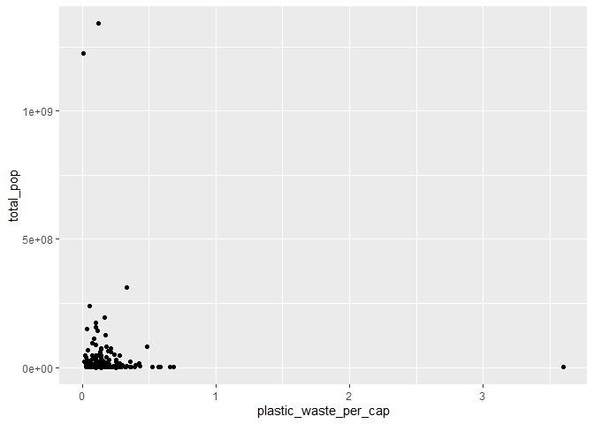

Lab 02 - Plastic waste
================
YooRi
Insert date here

## Load packages and data

``` r
library(tidyverse) 
```

``` r
plastic_waste <- read.csv("data/plastic-waste.csv")
glimpse(plastic_waste)
```

    ## Rows: 240
    ## Columns: 10
    ## $ code                             <chr> "AFG", "ALB", "DZA", "ASM", "AND", "A~
    ## $ entity                           <chr> "Afghanistan", "Albania", "Algeria", ~
    ## $ continent                        <chr> "Asia", "Europe", "Africa", "Oceania"~
    ## $ year                             <int> 2010, 2010, 2010, 2010, 2010, 2010, 2~
    ## $ gdp_per_cap                      <dbl> 1614.255, 9927.182, 12870.603, NA, NA~
    ## $ plastic_waste_per_cap            <dbl> NA, 0.069, 0.144, NA, NA, 0.062, 0.25~
    ## $ mismanaged_plastic_waste_per_cap <dbl> NA, 0.032, 0.086, NA, NA, 0.045, 0.01~
    ## $ mismanaged_plastic_waste         <int> NA, 29705, 520555, NA, NA, 62528, 52,~
    ## $ coastal_pop                      <int> NA, 2530533, 16556580, NA, NA, 379004~
    ## $ total_pop                        <int> 31411743, 3204284, 35468208, 68420, 8~

``` r
View(plastic_waste)
```

## Exercises

warm up: NA=missing data

### Exercise 1

TTO is the highest on their plastic\_waste\_per\_cap

``` r
ggplot(data=plastic_waste, aes(x=plastic_waste_per_cap))+
  geom_histogram(bandwidth=0.2)
```

    ## Warning: Ignoring unknown parameters: bandwidth

    ## `stat_bin()` using `bins = 30`. Pick better value with `binwidth`.

    ## Warning: Removed 51 rows containing non-finite values (stat_bin).

<!-- -->

``` r
ggplot(data = plastic_waste, aes(x = plastic_waste_per_cap)) +
  geom_density()
```

    ## Warning: Removed 51 rows containing non-finite values (stat_density).

<!-- -->

``` r
plastic_waste %>%
  filter(plastic_waste_per_cap>3.5)%>%
  View()


ggplot(data = plastic_waste, 
       mapping = aes(x = plastic_waste_per_cap, 
                     color = continent)) +
  geom_density()
```

    ## Warning: Removed 51 rows containing non-finite values (stat_density).

<!-- -->

``` r
ggplot(data = plastic_waste, 
       mapping = aes(x = plastic_waste_per_cap, 
                     color = continent, 
                     fill = continent)) +
  geom_density(alpha=0.5)
```

    ## Warning: Removed 51 rows containing non-finite values (stat_density).

<!-- -->

``` r
ggplot(data=plastic_waste, aes(x=plastic_waste_per_cap))+
  geom_histogram()+
  facet_wrap(~continent)
```

    ## `stat_bin()` using `bins = 30`. Pick better value with `binwidth`.

    ## Warning: Removed 51 rows containing non-finite values (stat_bin).

<!-- -->

### Exercise 2

it can cover other graph in the back layer. so, if we can make somewhat
transparent, we can see the back layer. color and fill can give us
intuitive information.

``` r
ggplot(data = plastic_waste, 
       mapping = aes(x = plastic_waste_per_cap, 
                     color = continent, 
                     fill = continent)) +
  geom_density(alpha=0.2)
```

    ## Warning: Removed 51 rows containing non-finite values (stat_density).

<!-- -->

``` r
ggplot(data = plastic_waste, 
       mapping = aes(x = continent, 
                     y = plastic_waste_per_cap)) +
  geom_boxplot()
```

    ## Warning: Removed 51 rows containing non-finite values (stat_boxplot).

<!-- -->

### Exercise 3

basic backgrounds on violin plot (since I saw this for the first time:D)

( if the following contains incorrect information, let me know plz..)

violin graph is symmetric, mirroring the estimation of Kernel Density
Estimation (KDE)–to my understanding, it can be used to smooth the
histogram.

with this plot, we can visualize the range of data
distribution–especially, more close to a real data distribution.

box plot has more apparent in median, 1rd/3rd quantile

reference: R graphics cookbook, author = winston chang

``` r
ggplot(data = plastic_waste, 
       mapping = aes(x = continent, 
                     y = plastic_waste_per_cap)) +
  geom_violin()
```

    ## Warning: Removed 51 rows containing non-finite values (stat_ydensity).

<!-- -->

``` r
# let's twist little more :D


ggplot(data = plastic_waste, 
       mapping = aes(x = continent, 
                     y = plastic_waste_per_cap)) +
  geom_violin()+
  geom_boxplot(width=.3, fill="green")+
  stat_summary(fun.y=median, geom="point")
```

    ## Warning: `fun.y` is deprecated. Use `fun` instead.

    ## Warning: Removed 51 rows containing non-finite values (stat_ydensity).

    ## Warning: Removed 51 rows containing non-finite values (stat_boxplot).

    ## Warning: Removed 51 rows containing non-finite values (stat_summary).

<!-- -->

### Exercise 4

it seems that it has positive relationship (4-1) yea, it seems a little.
(4-2) not really (4-3)

``` r
#4-1
ggplot(data = plastic_waste, 
       mapping = aes(x = plastic_waste_per_cap, 
                     y = mismanaged_plastic_waste_per_cap))+
  geom_point()
```

    ## Warning: Removed 51 rows containing missing values (geom_point).

<!-- -->

``` r
#4-2
ggplot(data = plastic_waste, 
       mapping = aes(x = plastic_waste_per_cap, 
                     y = mismanaged_plastic_waste_per_cap,
                     color=continent))+
  geom_point() #+
```

    ## Warning: Removed 51 rows containing missing values (geom_point).

<!-- -->

``` r
  #stat_smooth(method=lm)

#4-3
ggplot(data = plastic_waste, 
       mapping = aes(x = plastic_waste_per_cap, 
                     y = total_pop))+
  geom_point()
```

    ## Warning: Removed 61 rows containing missing values (geom_point).

<!-- -->

``` r
ggplot(data = plastic_waste, 
       mapping = aes(x = plastic_waste_per_cap, 
                     y = coastal_pop))+
  geom_point()
```

    ## Warning: Removed 51 rows containing missing values (geom_point).

<!-- -->

``` r
#4-3-2 XD
ggplot(data = plastic_waste, 
       mapping = aes(x = plastic_waste_per_cap, 
                     y = total_pop))+
  geom_point()+
  stat_smooth(method=lm)
```

    ## `geom_smooth()` using formula 'y ~ x'

    ## Warning: Removed 61 rows containing non-finite values (stat_smooth).

    ## Warning: Removed 61 rows containing missing values (geom_point).

<!-- -->

``` r
ggplot(data = plastic_waste, 
       mapping = aes(x = plastic_waste_per_cap, 
                     y = coastal_pop))+
  geom_point()+
  stat_smooth(method=lm)
```

    ## `geom_smooth()` using formula 'y ~ x'

    ## Warning: Removed 51 rows containing non-finite values (stat_smooth).

    ## Warning: Removed 51 rows containing missing values (geom_point).

<!-- -->

### Exercise 5

change background color/grid line color of the plot
references:<http://www.sthda.com/english/wiki/ggplot2-themes-and-background-colors-the-3-elements>

``` r
plastic_waste$cp_prop<-
  plastic_waste$coastal_pop/plastic_waste$total_pop

plastic_waste %>%
  filter(plastic_waste_per_cap<3)%>%
  ggplot(mapping = aes(x =cp_prop,
                     y = plastic_waste_per_cap,
                     ))+
  geom_point(aes(color=continent,))+
  stat_smooth(color="black")+
  scale_colour_viridis_d()+
  labs(title="plastic waste vs. coastal poplualtion portion",
       subtitle="by continent",
       x="Coastal population proportion(Coastal/total population)",
       y="Plastic waste per capita")+
  theme_minimal()
```

    ## `geom_smooth()` using method = 'loess' and formula 'y ~ x'

    ## Warning: Removed 10 rows containing non-finite values (stat_smooth).

    ## Warning: Removed 10 rows containing missing values (geom_point).

<!-- -->

reference: R graphics cookbook, author = winston chang
